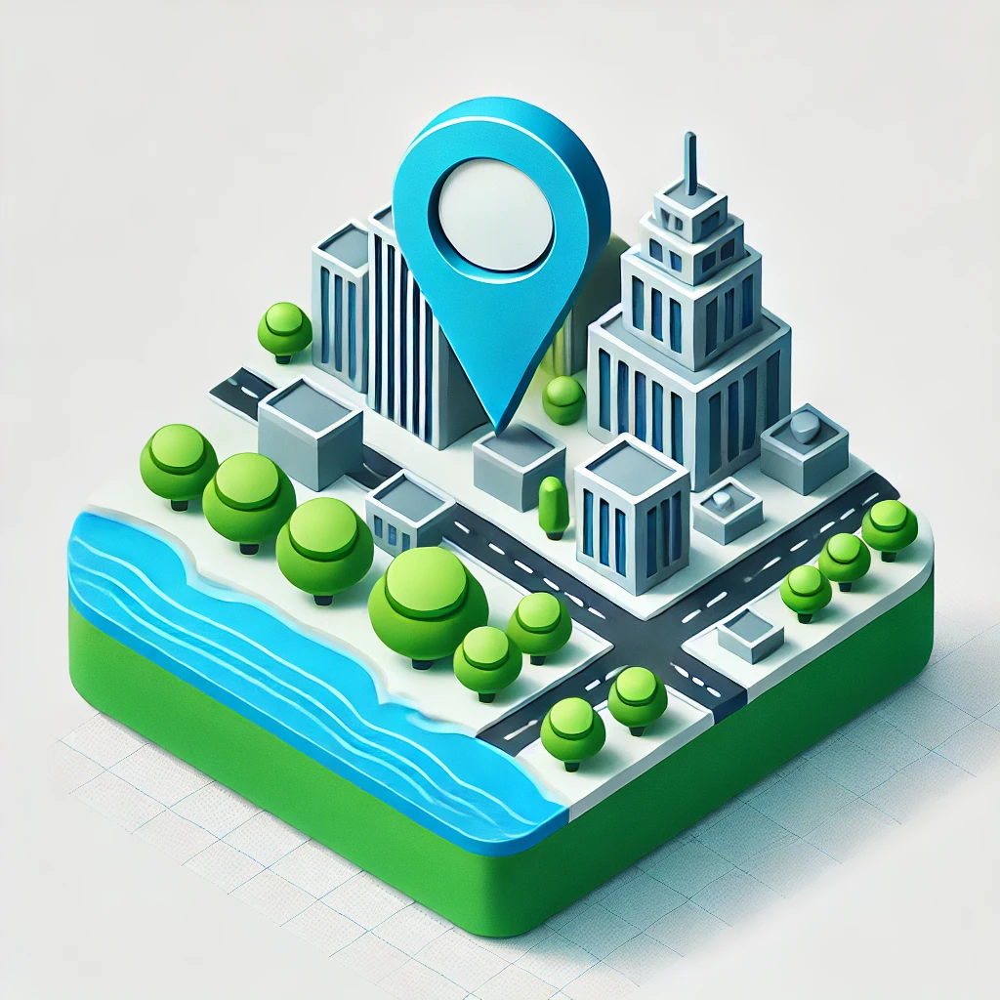

<h1 align="center" style="padding-bottom: 30px">
  
    
  
React Cartography

</h1 >

A collection of primitive React hooks and components that make it easy to integrate and build complex mapping solutions into your NextJS, Remix, Vite, or other React application.

